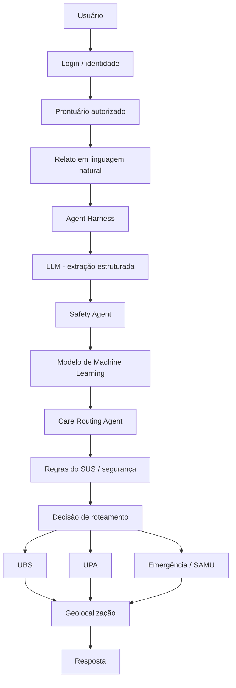

# Arquitetura — Health-flow

## Escopo acadêmico

O projeto será desenvolvido em três etapas.

```text
ETAPA 1
Encaminhamento assistencial
Agent Harness + Machine Learning
        ↓
ETAPA 2
Medicamentos no SUS
        ↓
ETAPA 3
Planos de saúde
```

A prioridade inicial é demonstrar, de maneira clara, a aplicação de conceitos de Inteligência Artificial sem transformar o sistema em ferramenta de diagnóstico.

---

# Etapa 1 — Agent Harness + Machine Learning

## Problema

O usuário entra no sistema, possui um prontuário/histórico vinculado e descreve em linguagem natural o que está sentindo.

O Health-flow deve transformar esse relato em uma recomendação de **tipo de serviço**, por exemplo:

- Atenção Primária / UBS;
- Urgência / UPA;
- Emergência / fluxo SAMU.

A saída é um encaminhamento, não um diagnóstico.

## Pipeline



## Responsabilidades

### Agent Harness

O Harness é o orquestrador.

Ele deve:

- controlar a ordem das etapas;
- decidir quais ferramentas podem ser usadas;
- combinar LLM, ML, regras e dados;
- interromper o fluxo comum quando houver regra crítica;
- impedir que a resposta final extrapole o objetivo do sistema;
- registrar o caminho que levou ao encaminhamento.

### LLM

O LLM interpreta linguagem natural.

Exemplo:

Entrada:

```text
Estou com uma dor muito forte no peito e estou com falta de ar há uns 20 minutos.
```

Saída estruturada:

```json
{
  "symptoms": ["dor no peito", "falta de ar"],
  "duration_minutes": 20,
  "severity_reported": "strong",
  "conscious": true
}
```

O LLM não deve produzir diagnóstico.

### Machine Learning

O Machine Learning deve fazer parte da Etapa 1 porque é requisito acadêmico.

Objetivo sugerido: **classificação auxiliar do nível de encaminhamento**.

Classes iniciais:

```text
0 = atenção primária
1 = urgência
2 = possível emergência
```

Features possíveis:

```text
- faixa etária
- duração
- número de sintomas
- intensidade relatada
- presença de sinais estruturados
- condições relevantes
- medicamentos relevantes
- recorrência
```

Saída possível:

```json
{
  "class": "urgent_care",
  "probability": 0.81,
  "distribution": {
    "primary_care": 0.08,
    "urgent_care": 0.81,
    "emergency": 0.11
  }
}
```

O modelo pode começar simples, por exemplo com:

- Logistic Regression;
- Decision Tree;
- Random Forest.

A escolha deve ser validada por métricas em um dataset apropriado.

O ML nunca deve ter autoridade para rebaixar uma regra crítica.

```python
ml_result = routing_model.predict(features)

if safety_rules.has_red_flag(features):
    final_route = "emergency"
else:
    final_route = harness.combine(ml_result, sus_rules)
```

### Safety Agent

Responsável por sinais críticos e guardrails.

Ele deve funcionar independentemente do resultado probabilístico do ML.

```text
relato
   ↓
extração
   ↓
red flags?
   ├── sim → fluxo de emergência
   └── não → ML + roteamento comum
```

### Care Routing Agent

Recebe:

- resultado do ML;
- regras;
- contexto autorizado;
- tipo de atendimento permitido.

Produz:

```json
{
  "care_level": "urgent_care",
  "service_type": "UPA",
  "reason_codes": [
    "acute_symptoms",
    "prompt_evaluation_required"
  ]
}
```

Não existe campo `diagnosis`.

## Emergência e SAMU

No MVP, o sistema deve detectar um **possível cenário de emergência** e orientar o fluxo correspondente.

```text
Possível emergência
        ↓
Harness interrompe fluxo normal
        ↓
confirma/localiza usuário
        ↓
orienta SAMU 192 / serviço de emergência
```

Uma futura integração oficial poderia encaminhar a solicitação para a central adequada, mas o sistema não deve simular despacho autônomo de ambulância.

## Localização

Depois de determinar o tipo de atendimento:

```text
care_level
    ↓
service_type
    ↓
localização do usuário
    ↓
busca apenas estabelecimentos compatíveis
    ↓
ordenação por distância/disponibilidade
    ↓
unidade mais adequada
```

O sistema não deve procurar simplesmente "o hospital mais próximo".

Primeiro determina o tipo de serviço; depois procura o estabelecimento correspondente.

---

# Prontuário e Context Builder

## Login

A pessoa entra no sistema e seu perfil fica associado ao prontuário/histórico autorizado.

CPF isoladamente não deve ser suficiente para liberar dados clínicos.

## Context Builder

O Agent Harness não deve enviar o prontuário inteiro ao modelo.

```text
Prontuário
    ↓
Context Builder
    ↓
seleção por relevância
    ↓
contexto mínimo
    ↓
agentes
```

Exemplo:

```json
{
  "relevant_context": {
    "age_range": "adult",
    "conditions": ["..."],
    "active_medications": ["..."],
    "allergies": ["..."]
  }
}
```

---

# RAG

RAG será usado como mecanismo de recuperação de conhecimento.

## Etapa 1

Pode recuperar:

- regras de navegação do SUS;
- protocolos;
- descrição dos tipos de estabelecimento;
- documentos oficiais relevantes.

## Etapa 2

Será ampliado para:

- medicamentos;
- RENAME;
- regras de dispensação;
- documentos estaduais/municipais quando disponíveis.

## Etapa 3

Será ampliado para:

- regras de cobertura;
- materiais dos planos;
- rede e documentação complementar quando disponível.

## Fluxo

```text
consulta
  ↓
embedding
  ↓
pgvector
  ↓
chunks relevantes
  ↓
metadados / filtros
  ↓
agente
```

---

# Persistência

## PostgreSQL

Dados estruturados:

```text
users
patient_profiles
consents
allergies
conditions
medications
encounters
routing_requests
routing_results
insurance_profiles
audit_logs
```

## pgvector

Conhecimento não estruturado:

```text
documents
document_chunks
embeddings
sources
metadata
```

## Object Storage

Arquivos originais:

```text
PDF
laudos
documentos
imagens
```

---

# Etapa 2 — Medicamentos no SUS

## Objetivo

Responder:

```text
"O SUS tem este medicamento?"
"Como consigo?"
"Onde encontro?"
```

## Arquitetura

```text
Usuário
  ↓
Agent Harness
  ↓
Medication Agent
  ↓
RAG / fontes oficiais
  ↓
regras de acesso
  ↓
localização
  ↓
ponto de acesso compatível
  ↓
resposta + fonte
```

Dados desejados:

- medicamento;
- apresentação;
- disponibilidade na relação aplicável;
- critérios;
- documentos necessários;
- local de acesso;
- fonte.

---

# Etapa 3 — Planos de saúde

## Objetivo

Responder:

```text
"Meu plano cobre este hospital?"
"Quais especialistas estão disponíveis?"
"Este médico está na minha rede?"
"Onde existe atendimento da minha rede?"
```

## Arquitetura

```text
Usuário
  ↓
plano vinculado
  ↓
Agent Harness
  ↓
Insurance Agent
  ↓
produto específico
  ↓
cobertura + rede
  ↓
Provider Agent
  ↓
especialistas / hospitais
  ↓
localização
  ↓
resposta
```

O sistema precisa conhecer o plano/produto específico, e não apenas o nome da operadora.

---

# Arquitetura completa

```text
                         HEALTH-FLOW

                              |
                              v
                         LOGIN / AUTH
                              |
                              v
                    PRONTUÁRIO AUTORIZADO
                              |
                              v
                       AGENT HARNESS
                              |
          +-------------------+-------------------+
          |                   |                   |
          v                   v                   v
         LLM                 ML              Safety Rules
          |                   |                   |
          +-------------------+-------------------+
                              |
                       Care Routing
                              |
                    Regras / RAG SUS
                              |
        +---------------------+---------------------+
        |                     |                     |
       UBS                   UPA              Emergência
        |                     |                     |
        +--------------- Geolocalização ------------+
                              |
                              v
                         RESPOSTA

ETAPA 2:
Harness → Medication Agent → RAG → SUS → localização

ETAPA 3:
Harness → Insurance Agent → cobertura/rede → especialistas/hospitais
```

---

# Estrutura de pastas sugerida

```text
health-flow/
├── app/
│   ├── agents/
│   │   ├── safety/
│   │   ├── intent/
│   │   ├── patient_context/
│   │   ├── care_routing/
│   │   ├── medication/
│   │   ├── insurance/
│   │   └── provider/
│   ├── harness/
│   ├── ml/
│   │   ├── training/
│   │   ├── inference/
│   │   ├── features/
│   │   └── evaluation/
│   ├── context_builder/
│   ├── rag/
│   ├── tools/
│   ├── guardrails/
│   ├── api/
│   ├── auth/
│   ├── database/
│   └── schemas/
├── data/
│   ├── raw/
│   └── processed/
├── models/
├── migrations/
├── tests/
│   ├── safety/
│   ├── ml/
│   ├── agents/
│   ├── rag/
│   └── integration/
└── docs/
    └── architecture.md
```

# Ordem de implementação

```text
1. autenticação e usuário
2. modelo simplificado de prontuário
3. contrato de entrada de sintomas
4. LLM → extração estruturada
5. dataset para roteamento
6. treinamento do primeiro modelo ML
7. avaliação do modelo
8. Safety Agent
9. Agent Harness
10. Care Routing Agent
11. regras de encaminhamento
12. geolocalização e busca de unidades
13. interface da Etapa 1
14. testes e auditoria
15. Etapa 2
16. Etapa 3
```

A primeira entrega acadêmica deve demonstrar claramente onde o **Machine Learning** é utilizado e onde o **Agent Harness** controla o fluxo.
