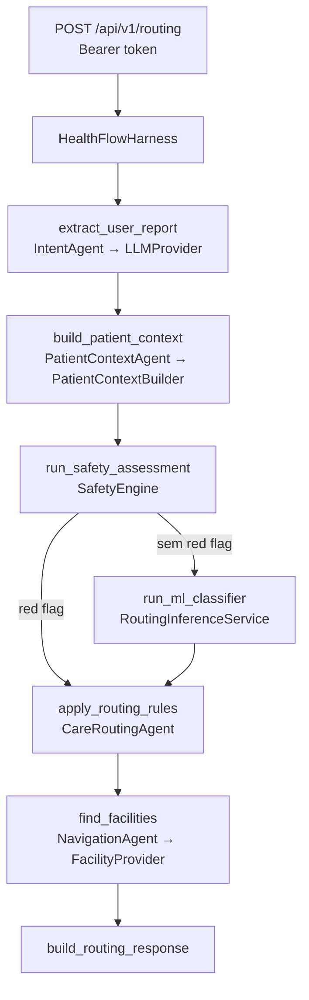

# Arquitetura — Health-flow

> **PROTÓTIPO ACADÊMICO — NÃO UTILIZAR PARA DECISÕES CLÍNICAS REAIS.**
> O Health-flow não diagnostica, não prescreve e não substitui profissionais de saúde.

## Estado atual

| Fase | Conteúdo | Estado |
|---|---|---|
| A | FastAPI, config, schemas, `LLMProvider`, Ollama, extração estruturada | ✅ implementado |
| B | Dataset sintético, features, treino/avaliação, persistência, inferência | ✅ implementado |
| C | Safety Engine, regras simuladas, *override* | ✅ implementado |
| D | Agent Harness, Care Routing, Context Builder | ✅ implementado |
| E | `MockFacilityProvider`, distância, seleção de unidade, endpoint | ✅ implementado |
| F | PostgreSQL, prontuário persistido, auditoria, autenticação real | ⏳ planejado (Postgres+pgvector já sobe no compose) |
| G | pgvector, pipeline RAG, documentos oficiais | ⏳ planejado |
| Etapa 2 | Medicamentos no SUS (`MedicationAgent` + RAG) | ⏳ planejado |
| Etapa 3 | Planos de saúde (`InsuranceAgent`, `ProviderAgent`) | ⏳ planejado |

Estilo: **monólito modular FastAPI**. Sem filas, microsserviços ou orquestradores externos.

## Onde está cada técnica de IA

| Pergunta | Resposta | Código |
|---|---|---|
| Onde existe IA generativa? | LLM local (Ollama, `qwen3:4b`) converte texto livre em JSON tipado | `app/llm/`, `app/agents/intent_agent.py` |
| Onde existe Machine Learning? | Classificador supervisionado treinado (scikit-learn) sugere o nível de encaminhamento | `app/ml/` — ver [machine-learning.md](machine-learning.md) |
| Onde existe Agent Harness? | Máquina de estados explícita que coordena etapas, falhas e autoridade | `app/harness/` |
| Onde existe RAG? | Ainda não implementado (Fase G). Postgres com pgvector já provisionado | `scripts/db/init-pgvector.sql` |

### Por que LLM e ML são coisas diferentes aqui

- **LLM (generativo, pré-treinado)**: entende linguagem natural ("dor forte no peito há 20 min") e
  devolve **estrutura** (`chest_pain`, `20`, `severe`). Não é treinado por nós, não produz
  probabilidades calibradas por classe e pode alucinar — por isso a saída é restrita por JSON Schema,
  validada por Pydantic e **não decide nada**.
- **ML (discriminativo, treinado por nós)**: recebe **features numéricas** derivadas da estrutura e do
  contexto e devolve `P(PRIMARY_CARE)`, `P(URGENT_CARE)`, `P(EMERGENCY)`. É reproduzível
  (`random_state`), avaliável com métricas e versionado — mas é auxiliar.
- **Regras (determinísticas)**: sinais críticos com identificador, testáveis um a um; só podem
  **subir** o nível.

```text
LLM entende.  ML classifica.  Regras protegem.  Tools consultam.  Harness coordena.
```

## Fluxo da Etapa 1



`HarnessState` acumula: `request_id`, `user_id`, `user_message` (só em memória), `extracted_symptoms`,
`patient_context`, `safety_assessment`, `ml_prediction`, `routing_decision`, `facilities`, `errors`.
Cada etapa é um método público testável isoladamente e envolto em `trace_stage` (log de etapa,
duração e status; ponto único para adicionar OpenTelemetry depois).

## Invariantes de segurança

1. **Nível final ≥ piso do Safety Engine** e **≥ predição do ML**. Implementado em
   `CareRoutingAgent.decide` e testado para todas as combinações (`tests/safety/test_care_routing.py`).
   `Safety=EMERGENCY` + `ML=PRIMARY_CARE` → `EMERGENCY`.
2. Com *red flag*, o ML nem é executado.
3. As regras também procuram padrões no **texto bruto** (sem acento, minúsculo). Se o LLM falhar ou
   não extrair o sinal crítico, a regra ainda dispara. Negações não são interpretadas — de propósito,
   o erro fica do lado seguro.
4. **LLM indisponível**: se o texto bruto disparar *red flag* → resposta de emergência mesmo assim;
   caso contrário → HTTP 503 com mensagem segura e lembrete do SAMU 192.
5. **ML indisponível** → fallback conservador `URGENT_CARE`.
6. **Nenhuma unidade encontrada** → resposta mantém o nível e a orientação, com `facility: null`.
7. A resposta não tem campo de diagnóstico; o sistema **não aciona** o SAMU — apenas orienta ligar 192.

## Safety Engine

- Regras declarativas (`SafetyRule`) com `id`, `minimum_care_level`, condições de sintomas,
  intensidade mínima, faixas etárias e padrões de texto (`app/safety/rules.py`).
- Todas marcadas `source = "ACADEMIC_SIMULATED — not an official SUS protocol"`.
- Formato declarativo para permitir, no futuro, carregar regras validadas de fonte oficial sem mudar
  o motor.

| ID | Gatilho (simulado) | Piso |
|---|---|---|
| RED_FLAG_001 | dor no peito **e** falta de ar | EMERGENCY |
| RED_FLAG_002 | perda de consciência / "desmai" | EMERGENCY |
| RED_FLAG_003 | convulsão | EMERGENCY |
| RED_FLAG_004 | face/fala/fraqueza unilateral | EMERGENCY |
| RED_FLAG_005 | sangramento intenso | EMERGENCY |
| RED_FLAG_006 | falta de ar intensa / "não consigo respirar" | EMERGENCY |
| RED_FLAG_007 | ideação autolesiva | EMERGENCY |
| CAUTION_001 | dor no peito isolada | URGENT_CARE |
| CAUTION_002 | febre intensa | URGENT_CARE |
| CAUTION_003 | febre em lactente ou idoso | URGENT_CARE |

## LLM

- `LLMProvider` (Protocol) com um método: `generate_structured(messages, output_model) -> T`.
- `OllamaLLMProvider` usa o **OpenAI Python SDK** apontando para `HEALTHFLOW_LLM_BASE_URL`
  (padrão `http://localhost:11434/v1`). Trocar para outro provedor compatível = mudar variáveis;
  provedor incompatível = nova classe que implementa o Protocol. Agentes não mudam.
- *Structured Outputs* via `response_format: json_schema` (suportado pelo Ollama 0.34), `temperature=0`,
  raciocínio desligado (`reasoning_effort="none"`), *timeout*, *retry* de transporte pelo SDK e *retry*
  limitado para JSON inválido. Erros viram `LLMUnavailableError` / `LLMResponseError`.
- O LLM **só recebe o relato**. Prontuário e contexto nunca são enviados a ele.

## Prontuário e Context Builder

- `PatientRepository` (Protocol). Hoje: `InMemoryPatientRepository` com **um paciente fictício**.
  Fase F: implementação SQLAlchemy. Nenhuma integração com sistemas do SUS.
- `PatientContextBuilder` aplica minimização: remove nome e histórico livre; inclui alergias só se os
  sintomas sugerirem reação alérgica, anticoagulantes só se houver sangramento/trauma/sinal
  neurológico; condições viram fatores de risco categóricos.

## Geolocalização

`care_level → service_type → unidades compatíveis → distância (haversine) → raio → mais próxima`.
Nunca "o hospital mais próximo". `FacilityProvider` (Protocol) com `MockFacilityProvider` e cinco
unidades **fictícias** em São Paulo, todas marcadas `is_simulated: true`. Futuro: `CNESFacilityProvider`.

## Autenticação (provisória)

`DemoTokenAuthenticator`: um *bearer token* estático (`HEALTHFLOW_DEMO_AUTH_TOKEN`) mapeado para um
usuário demo. Desligado se vazio; a configuração **recusa iniciar** com ele em `production`. CPF nunca é
usado como credencial. Substituição por autenticação real é parte da Fase F.

## Privacidade e observabilidade

- Logs JSON com `request_id`, etapa, duração, status, IDs de regras e nível final.
  **Nunca** o texto do relato, o prompt ou o prontuário.
- `X-Request-ID` aceito apenas se for UUID (evita injeção em logs); sempre devolvido na resposta.
- Exceções mapeadas para mensagens públicas fixas; *stack trace* só no log do servidor.
- Segredos via `.env` (ignorado pelo git); `.env.example` documenta as variáveis.

## Estrutura

```text
app/
├── main.py                    # create_app + lifespan (carrega o modelo, não treina)
├── api/                       # rotas, middleware de request_id, mapeamento de erros, DI
│   └── dependencies/container.py   # composition root: única escolha de implementações
├── core/                      # config, exceções, logging estruturado
├── auth/                      # Principal, DemoTokenAuthenticator
├── agents/                    # intent, patient_context, care_routing, navigation
├── harness/                   # HealthFlowHarness, HarnessState, montagem da resposta
├── llm/                       # LLMProvider, OllamaLLMProvider
├── ml/                        # features, métricas, classifier, inference, training/
├── safety/                    # SafetyRule, regras acadêmicas, SafetyEngine
├── context/                   # PatientContextBuilder
├── repositories/              # PatientRepository + implementação em memória
├── tools/                     # FacilityProvider, MockFacilityProvider, haversine
└── schemas/                   # CareLevel, ServiceType, Symptom, Patient, Routing, Facility
tests/{unit,safety,ml,integration}
```

Diferenças deliberadas em relação ao rascunho anterior:

- Não existe `safety_agent.py`: o Safety Engine é determinístico e chamado diretamente pelo Harness —
  chamá-lo de "agente" esconderia que ele não depende de modelo algum.
- `rag/`, `services/` e `repositories/routing.py` só serão criados nas fases que os usam (YAGNI).
- `FacilityProvider.find_nearby` recebe `service_type` (não `care_level`): o mapeamento
  nível → tipo de serviço é decisão do roteamento, não do provedor de localização.
- Destinos: três classes (`PRIMARY_CARE`, `URGENT_CARE`, `EMERGENCY`). "Hospital" e "SAMU" ficam
  dentro de `EMERGENCY` (pronto-socorro + orientação de ligar 192).

## Persistência (Fase F — planejado)

PostgreSQL + SQLAlchemy 2 + Alembic:

```text
users, patient_profiles, consents, allergies, conditions, medications, encounters,
routing_requests, routing_results, audit_logs
```

`routing_results` guardará nível, códigos de razão, versão do modelo e regras acionadas — **não** o
texto do relato por padrão.

## RAG (Fase G — planejado)

Separado do prontuário. O prontuário **não** vira embedding por padrão.

```text
documents(id, source, title, version, published_at, url, document_type)
document_chunks(id, document_id, content, embedding vector, metadata)
```

Consulta → embedding → pgvector → *chunks* com metadados → agente → resposta **com fonte**.

## Etapa 2 — Medicamentos no SUS (planejado)

```text
Harness → MedicationAgent → RAG (fontes oficiais, ex.: RENAME) → regras de acesso
        → FacilityProvider (pontos de dispensação) → resposta + fonte
```

O LLM não pode afirmar disponibilidade sem documento recuperado que a sustente.

## Etapa 3 — Planos de saúde (planejado)

```text
Harness → InsuranceAgent (produto/plano específico) → cobertura + rede verificável
        → ProviderAgent (especialistas/hospitais) → localização → resposta
```

Conhecer a operadora não basta: a cobertura depende do produto contratado.
