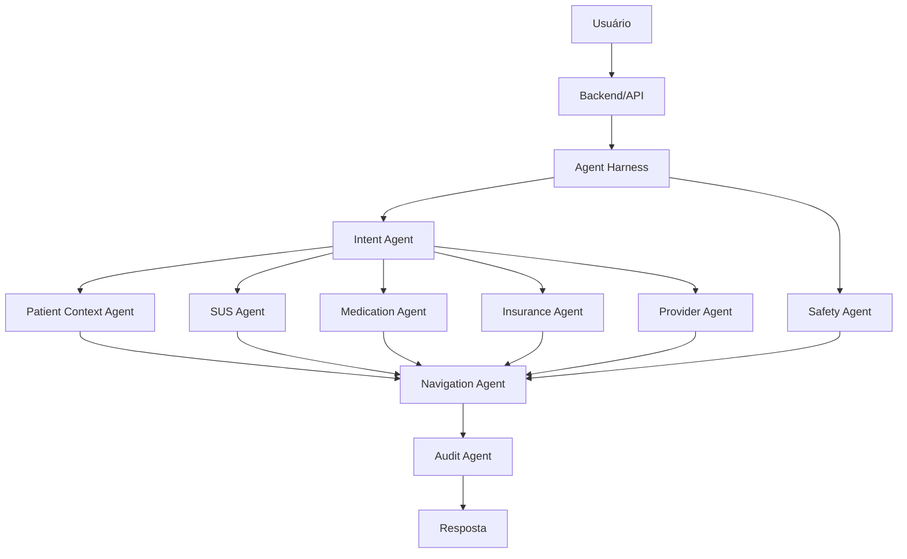

# Arquitetura do Health-flow

## Visão geral

O Health-flow usa uma arquitetura orientada a agentes em que o **Agent Harness** atua como orquestrador central.

O LLM não deve acessar livremente todas as ferramentas. O Harness determina quais ações são permitidas com base na intenção, nível de risco, consentimento e contexto da solicitação.

## Fluxo principal



## Ordem de decisão

A ordem importa.

```text
1. Segurança
2. Intenção
3. Consentimento e identidade
4. Dados necessários
5. Ferramentas autorizadas
6. Consulta às fontes
7. Consolidação
8. Auditoria
9. Resposta
```

Por exemplo, uma possível emergência deve interromper um fluxo comum de busca de cobertura de plano.

## Tools previstas

### Saúde pública

- busca de estabelecimentos;
- informações sobre UBS, UPA, hospitais e CAPS;
- serviços oferecidos;
- medicamentos e regras de dispensação;
- informações administrativas relevantes do SUS.

### Saúde suplementar

- operadora;
- produto/plano;
- cobertura;
- rede credenciada;
- autorização;
- prestadores disponíveis.

### Localização

A localização deve ser solicitada somente quando necessária e com autorização do usuário.

Ela pode ser utilizada para calcular proximidade de:

- UBS;
- UPA;
- hospitais;
- CAPS;
- farmácias;
- clínicas;
- profissionais da rede credenciada.

### Dados clínicos

Integrações com dados de saúde devem obedecer autenticação, autorização, consentimento, minimização e auditoria.

Nunca usar CPF isoladamente como mecanismo suficiente para acesso.

## Guardrails

Algumas decisões devem ser regras de software e não apenas prompts.

Exemplos:

```python
if emergency_signals:
    block_normal_flow()
    route_to_urgent_care()

if tool_requires_health_data and not consent:
    deny_tool_call()

if medication_answer and not official_source:
    block_final_answer()

if insurance_coverage_answer and not verified_plan_data:
    return_uncertain_result()
```

## Contrato entre agentes

Cada agente deve retornar estruturas tipadas.

Exemplo:

```json
{
  "agent": "safety",
  "status": "completed",
  "risk_level": "urgent",
  "reason_codes": [
    "chest_pain",
    "shortness_of_breath"
  ],
  "recommended_route": "urgent_care",
  "confidence": 0.94
}
```

O texto destinado ao usuário deve ser produzido somente depois da consolidação dos resultados.

## Fontes de verdade

O LLM deve interpretar e explicar.

Ele não deve ser a fonte primária para:

- disponibilidade de medicamentos;
- cobertura de plano;
- rede credenciada;
- localização de unidades;
- informações de prontuário;
- horários e disponibilidade;
- requisitos administrativos.

Essas respostas devem vir de tools, APIs, bancos autorizados ou documentos oficiais.

## RAG

RAG pode ser utilizado para consultar documentos como:

- protocolos;
- manuais;
- regras administrativas;
- documentação de medicamentos;
- políticas de cobertura;
- perguntas frequentes oficiais.

O RAG deve preservar metadados da fonte e permitir citações.

## Machine Learning

Um modelo próprio de ML é opcional no MVP.

Uma futura implementação poderia receber features estruturadas e produzir uma classificação auxiliar:

```text
idade
sintomas estruturados
duração
sinais de alerta
contexto relevante
       |
       v
modelo de ML
       |
       v
classe auxiliar
```

Possíveis classes:

- atenção primária;
- atendimento prioritário;
- urgência.

Mesmo nesse cenário, regras críticas de segurança continuam independentes do modelo.

## Observabilidade

Cada execução do Harness deve registrar:

- request ID;
- agentes executados;
- ferramentas chamadas;
- fontes consultadas;
- consentimentos utilizados;
- tempos de execução;
- erros;
- regras de segurança ativadas;
- versão do prompt/modelo;
- resultado final.

Não registrar dados clínicos desnecessários.

## Estrutura de projeto sugerida

```text
health-flow/
├── app/
│   ├── agents/
│   │   ├── safety/
│   │   ├── intent/
│   │   ├── sus/
│   │   ├── medication/
│   │   ├── insurance/
│   │   ├── provider/
│   │   └── navigation/
│   ├── harness/
│   ├── tools/
│   ├── guardrails/
│   ├── api/
│   └── schemas/
├── tests/
│   ├── safety/
│   ├── agents/
│   └── integration/
├── docs/
│   └── architecture.md
└── README.md
```

## Próxima implementação recomendada

Começar por um fluxo vertical pequeno:

```text
Usuário descreve necessidade
        ↓
Intent Agent
        ↓
Safety Agent
        ↓
Harness decide rota
        ↓
busca de estabelecimento / medicamento
        ↓
Navigation Agent
        ↓
resposta com fonte
```

Isso permite validar o Harness antes de integrar prontuário e planos de saúde, que possuem maior complexidade técnica, regulatória e de privacidade.
