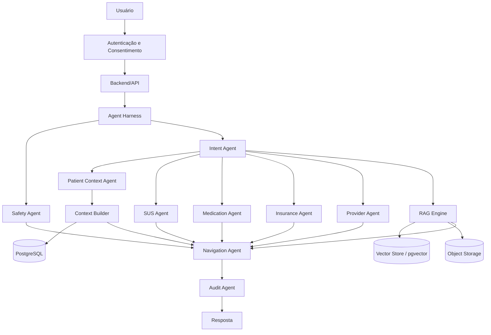

# Arquitetura do Health-flow

## Visão geral

O Health-flow usa uma arquitetura orientada a agentes em que o **Agent Harness** atua como orquestrador central.

O usuário deve se autenticar e vincular sua identidade antes de qualquer acesso a dados clínicos. Depois disso, o sistema pode exibir uma área de prontuário/histórico com os dados que estiverem disponíveis e autorizados.

O LLM não deve receber o prontuário completo por padrão. O Harness decide quais informações são realmente necessárias para a solicitação atual e monta um contexto mínimo antes de chamar o modelo.

A arquitetura separa quatro responsabilidades principais:

1. dados clínicos estruturados do paciente;
2. documentos e conhecimento para RAG;
3. arquivos originais, como laudos e PDFs;
4. orquestração por Agent Harness.

## Fluxo de autenticação e prontuário

```text
Usuário
   |
   v
Autenticação / vínculo de identidade
   |
   v
Consentimento e autorização
   |
   v
Backend consulta dados clínicos autorizados
   |
   v
Prontuário / histórico do paciente
   |
   v
Context Builder
   |
   v
Somente contexto relevante
   |
   v
Agent Harness + LLM + Tools
```

O CPF isoladamente não é suficiente para liberar acesso ao prontuário.

O sistema deve considerar mecanismos adequados de autenticação, autorização, consentimento, rastreabilidade e controle de acesso.

## Prontuário exibido ao usuário

A interface pode apresentar uma visão organizada do histórico disponível, por exemplo:

```text
Meu Prontuário

- Medicamentos
- Alergias
- Condições registradas
- Consultas
- Exames
- Vacinas
- Atendimentos
- Documentos clínicos
```

A informação mostrada ao usuário pode ser ampla, mas isso não significa que todo esse conteúdo será enviado ao LLM.

## Context Builder

Entre o prontuário e o LLM deve existir uma camada de seleção de contexto.

```text
Prontuário completo
        |
        v
Context Builder
        |
        +--> intenção atual
        +--> regras de minimização
        +--> permissões do usuário
        +--> relevância clínica
        |
        v
Contexto mínimo necessário
        |
        v
LLM
```

Exemplo: se o usuário pergunta apenas onde retirar um medicamento, não há motivo para enviar anos de histórico médico ao modelo.

Um contexto enviado ao agente poderia ser algo como:

```json
{
  "patient_context": {
    "active_medications": ["..."],
    "allergies": ["..."],
    "relevant_conditions": ["..."]
  }
}
```

## Fluxo principal do Agent Harness



## Ordem de decisão

```text
1. Segurança
2. Intenção
3. Identidade
4. Consentimento
5. Dados necessários
6. Construção do contexto mínimo
7. Seleção de ferramentas
8. Consulta às fontes
9. Consolidação
10. Auditoria
11. Resposta
```

Uma possível emergência deve interromper fluxos administrativos, como consulta de cobertura de plano.

## Armazenamento

O Health-flow não deve usar banco vetorial como substituto de banco relacional.

A arquitetura recomendada possui três camadas principais de armazenamento.

### 1. Banco relacional

Sugestão: **PostgreSQL**.

Deve armazenar dados estruturados e que exigem consultas exatas, como:

- pacientes;
- vínculos de identidade;
- consentimentos;
- medicamentos ativos;
- alergias;
- condições clínicas;
- consultas;
- exames estruturados;
- plano de saúde;
- autorizações;
- auditoria.

Exemplo:

```sql
SELECT allergy_name
FROM patient_allergies
WHERE patient_id = :patient_id;
```

Esse tipo de dado não precisa de busca vetorial.

### 2. Banco vetorial

Sugestão para o MVP: **PostgreSQL + pgvector**.

O banco vetorial deve ser usado principalmente para recuperação semântica de documentos e conteúdo não estruturado.

Exemplos:

- protocolos clínicos;
- manuais do SUS;
- políticas administrativas;
- documentação de medicamentos;
- regras de cobertura;
- FAQs oficiais;
- notas clínicas não estruturadas, quando houver justificativa e autorização;
- chunks de documentos.

Estrutura conceitual:

```text
document_chunks
- id
- source
- title
- text
- metadata
- embedding VECTOR(...)
```

### 3. Object Storage

Arquivos originais devem permanecer fora do banco vetorial.

Exemplos:

- PDFs;
- laudos;
- documentos médicos;
- imagens;
- arquivos recebidos de integrações.

Pode ser usado S3 ou serviço compatível.

## RAG

O RAG serve para recuperar conhecimento documental relevante antes da geração da resposta.

Fluxo:

```text
Pergunta
   |
   v
Embedding
   |
   v
Busca vetorial
   |
   v
Chunks relevantes
   |
   v
Filtros por fonte / data / domínio
   |
   v
LLM
   |
   v
Resposta com referência da fonte
```

O RAG é recomendado para:

- protocolos do SUS;
- documentação oficial;
- regras de medicamentos;
- RENAME e documentos relacionados;
- regras administrativas;
- políticas de cobertura;
- manuais;
- FAQs;
- documentos de planos quando legalmente e tecnicamente disponíveis.

O RAG deve preservar:

- origem;
- URL ou identificador da fonte;
- data;
- versão;
- metadados;
- trecho utilizado.

## O prontuário não deve ser tratado como um grande RAG

O prontuário é uma fonte primária de dados pessoais e clínicos.

A regra geral deve ser:

```text
Dados estruturados do paciente
        |
        v
Consulta direta ao banco/API

Documentos e conhecimento
        |
        v
RAG / busca vetorial
```

É aceitável usar busca vetorial sobre partes não estruturadas do histórico quando houver um caso de uso claro, controle de acesso e justificativa técnica.

Mesmo nesse caso, o resultado recuperado deve passar pelo Context Builder antes de chegar ao LLM.

## Tools previstas

### Saúde pública

- busca de estabelecimentos;
- UBS;
- UPA;
- hospitais;
- CAPS;
- serviços oferecidos;
- medicamentos;
- regras de dispensação;
- informações administrativas do SUS.

### Saúde suplementar

- operadora;
- produto/plano;
- cobertura;
- rede credenciada;
- autorização;
- prestadores disponíveis.

### Localização

A localização deve ser acessada somente quando necessária.

Pode ser usada para encontrar:

- UBS;
- UPA;
- hospitais;
- CAPS;
- farmácias;
- clínicas;
- profissionais credenciados.

### Dados clínicos

O Patient Context Agent pode consultar apenas informações necessárias e autorizadas.

Exemplos:

- alergias;
- medicamentos ativos;
- condições relevantes;
- exames recentes;
- histórico necessário para aquela interação.

## Exemplo de execução

Usuário:

> Estou com muita tontura e fraqueza.

Fluxo:

```text
Intent Agent
     |
     v
Safety Agent
     |
     v
Patient Context Agent
     |
     v
Context Builder
     |
     +--> medicamentos relevantes
     +--> alergias
     +--> condições relacionadas
     |
     v
RAG
     |
     +--> protocolo apropriado
     |
     v
Provider Agent
     |
     +--> unidade adequada, se necessário
     |
     v
Navigation Agent
     |
     v
Resposta
```

## Guardrails

Algumas decisões devem ser implementadas em software, não apenas em prompt.

```python
if emergency_signals:
    block_normal_flow()
    route_to_urgent_care()

if tool_requires_health_data and not consent:
    deny_tool_call()

if patient_context_requested:
    context = build_minimum_required_context()

if medication_answer and not official_source:
    block_final_answer()

if insurance_coverage_answer and not verified_plan_data:
    return_uncertain_result()

if model_requests_full_record_without_reason:
    deny_full_record_access()
```

## Contrato entre agentes

Os agentes devem retornar estruturas tipadas.

Exemplo:

```json
{
  "agent": "safety",
  "status": "completed",
  "risk_level": "urgent",
  "reason_codes": [
    "chest_pain",
    "shortness_of_breath"
  ],
  "recommended_route": "urgent_care",
  "confidence": 0.94
}
```

## Fontes de verdade

O LLM interpreta e explica, mas não deve ser a fonte primária para:

- prontuário;
- medicamentos disponíveis;
- cobertura de plano;
- rede credenciada;
- localização de unidades;
- horários;
- requisitos administrativos;
- disponibilidade de atendimento.

Essas informações devem vir de APIs, bancos autorizados, ferramentas ou documentos oficiais.

## Machine Learning

Machine Learning próprio continua opcional no MVP.

A primeira versão pode funcionar com:

- Agent Harness;
- LLM;
- regras determinísticas;
- RAG;
- ferramentas;
- APIs;
- PostgreSQL;
- pgvector.

Um modelo de ML específico pode ser adicionado depois para problemas mensuráveis, como:

- previsão de demanda;
- classificação auxiliar;
- priorização operacional;
- recomendação de fluxo;
- detecção de padrões.

Decisões clínicas críticas não devem depender exclusivamente de um modelo de ML.

## Stack sugerida

```text
Frontend
React / Next.js

Backend
Python + FastAPI

Orquestração
Agent Harness

LLM
OpenAI

Banco principal
PostgreSQL

Busca vetorial
pgvector

RAG
Embeddings + retrieval + filtros de metadados

Cache
Redis

Arquivos
S3 / Object Storage

Autenticação
OAuth / mecanismo autorizado

Observabilidade
Logs + tracing + auditoria
```

Para um MVP, PostgreSQL + pgvector reduz a complexidade operacional porque permite manter dados relacionais e vetoriais no mesmo ecossistema.

## Estrutura sugerida do projeto

```text
health-flow/
├── app/
│   ├── agents/
│   │   ├── safety/
│   │   ├── intent/
│   │   ├── patient_context/
│   │   ├── sus/
│   │   ├── medication/
│   │   ├── insurance/
│   │   ├── provider/
│   │   └── navigation/
│   ├── harness/
│   ├── context_builder/
│   ├── rag/
│   ├── tools/
│   ├── guardrails/
│   ├── api/
│   ├── auth/
│   ├── database/
│   └── schemas/
├── migrations/
├── tests/
│   ├── safety/
│   ├── agents/
│   ├── rag/
│   └── integration/
├── docs/
│   └── architecture.md
└── README.md
```

## Modelo conceitual final

```text
                         HEALTH-FLOW

                              |
                              v
                       Frontend / App
                              |
                    Login / autenticação
                              |
                    Consentimento / vínculo
                              |
                              v
                         Backend API
                              |
                              v
                      +---------------+
                      | Agent Harness |
                      +-------+-------+
                              |
       +----------------------+----------------------+
       |                      |                      |
       v                      v                      v
Prontuário estruturado     RAG Engine               Tools
       |                      |                      |
       v                      v                      +--> localização
 PostgreSQL             Vector DB / pgvector        +--> SUS
       |                      |                      +--> planos
       |                      +--> protocolos        +--> medicamentos
       |                      +--> manuais           +--> unidades
       |                      +--> documentos
       |
       +--> medicamentos
       +--> alergias
       +--> consultas
       +--> exames
       +--> condições
       |
       v
 Context Builder
       |
       v
 Contexto mínimo para o LLM
```

## Próxima implementação recomendada

A primeira implementação deve validar um fluxo vertical completo:

```text
Usuário autenticado
        |
        v
Consentimento
        |
        v
Usuário descreve necessidade
        |
        v
Intent Agent
        |
        v
Safety Agent
        |
        v
Context Builder
        |
        +--> banco do paciente, se necessário
        +--> RAG, se necessário
        +--> tools externas, se necessário
        |
        v
Navigation Agent
        |
        v
Resposta com fonte e próximo passo
```

Esse desenho mantém dados estruturados, RAG e raciocínio do agente separados, reduz exposição de dados pessoais e deixa o sistema mais fácil de auditar e evoluir.
