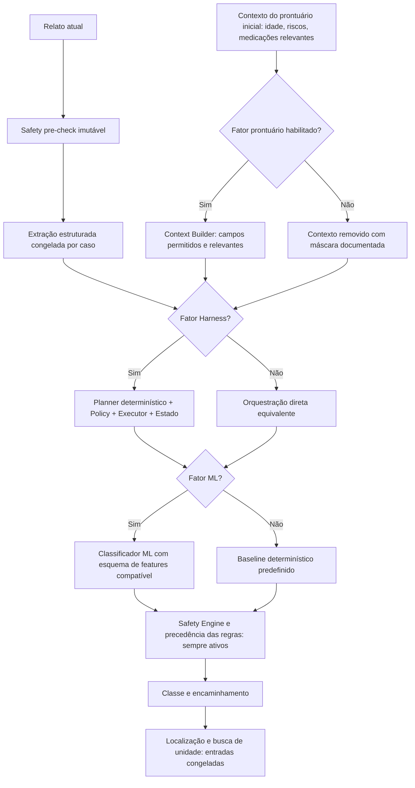

# Benchmark fatorial Health-flow: Harness × ML × contexto de prontuário

> **Protocolo pré-registrado de desenvolvimento, não resultados executados.** O Health-flow é um protótipo acadêmico não validado clinicamente. Atualizado em 2026-10-08.

## Questões de pesquisa

- QP1: Qual a contribuição do classificador de ML, comparado a um classificador determinístico, para o encaminhamento final?
- QP2: Qual a contribuição do Harness determinístico para integridade da execução, tolerância a falhas e latência?
- QP3: Qual a contribuição do **contexto disponível do prontuário inicial**, além do relato atual, para as decisões?
- QP4: Existem interações entre ML, Harness e contexto, inclusive casos em que o contexto aumenta o risco de subtriagem?

O **prontuário único** é um objetivo arquitetural. No repositório, o protótipo usa um perfil fictício simplificado em memória; não possui integração comprovada com prontuário único nacional, hospitalar ou longitudinal. Não denominar os experimentos atuais de validação de prontuário único real.

## Diagrama da arquitetura avaliada



**Regra fundamental:** desligar o Harness não pode desligar Safety Pre-check nem Safety Engine. Desligar o prontuário não pode remover informações de risco presentes no próprio relato do paciente. Não usar dados identificáveis, inventados como se fossem reais, ou disponíveis após o instante da decisão.

## Matriz 2 × 2 × 2 — oito configurações

| ID | Harness | ML | Prontuário | Comparação |
|---|---|---|---|---|
| E000 | não | não | não | referência mínima com regras de segurança |
| E001 | não | não | sim | efeito do contexto nas regras |
| E010 | não | sim | não | efeito do ML sem contexto |
| E011 | não | sim | sim | ML + contexto sem Harness |
| E100 | sim | não | não | efeito do Harness com regras |
| E101 | sim | não | sim | Harness + contexto |
| E110 | sim | sim | não | Harness + ML sem contexto |
| E111 | sim | sim | sim | sistema completo |

Interpretação dos fatores: estimar o efeito principal do Harness pela média das quatro diferenças pareadas E1mp - E0mp; do ML pela média E h1p - E h0p; e do prontuário pela média E hm1 - E hm0 (com índices binários). Relatar interações, não somente médias, e incerteza estatística por paciente/cenário.

## Diagrama do desenho experimental


## Intervenção de contexto do prontuário

1. Especificar um esquema versionado com campos disponíveis antes do encaminhamento. O protótipo existente prioriza idade/faixa etária, fatores de risco categóricos, anticoagulantes quando pertinentes e alergias quando pertinentes. Não afirmar ter dados reais ou integração nacional.
2. Na condição **com contexto**, passar apenas campos relevantes, com rastreabilidade de cada campo usado. Na condição **sem contexto**, mascarar os atributos do prontuário mantendo exatamente o mesmo relato e a mesma extração de sintomas.
3. O conjunto de dados precisa conter **pares relato–prontuário–rótulo independente**. Nunca preencher prontuários fictícios sobre pacientes MIMIC e tratá-los como registros observados. Casos contrafactuais sintéticos devem ser identificados separadamente.
4. Modelos com e sem contexto devem ser treinados em features compatíveis com sua respectiva condição, usando as mesmas partições e procedimento de seleção. Não passar colunas ausentes ao modelo treinado com outras colunas.
5. Registrar o efeito do contexto sobre: classe antes do piso de segurança; classe após as regras; mudança de encaminhamento; benefício/dano ante rótulo; e influência por campo de contexto.
6. Executar controles de **informação ausente, contraditória, desatualizada e indisponível**. A ausência de prontuário não deve impedir encaminhamento seguro.

## Regras de comparabilidade

- Mesmo corpus, rótulos de referência definidos **independentemente** da implementação, hash do corpus, partições por paciente, versões e hardware.
- Mesma extração estruturada e parâmetros de LLM por caso, idealmente com cache local isolado; comparar LLM separadamente se desejado.
- **Sem Harness** = orquestração direta que realiza as mesmas operações e invoca as mesmas regras, sem planner/policy/estado do Harness. Registrar funcionalidade perdida de forma deliberada; não construir baseline artificialmente defeituosa.
- **Sem ML** = classificador por regras escrito, versionado e congelado **antes** da avaliação; não usar o Safety Engine sozinho como se fosse um classificador completo, salvo se todas as três classes forem cobertas por regras explícitas.
- Jamais ajustar o baseline depois de observar o conjunto de teste.
- Separar qualidade clínica das classes, confiabilidade de execução e desempenho de busca geográfica.
- Para medir benefício real do Harness, além de casos regulares, injetar falhas equivalentes de LLM, ferramentas, timeouts e respostas inválidas nos dois orquestradores.
- Controle de vazamento: não usar sinais, procedimentos, desfechos ou decisões registrados **depois** do instante de triagem.

## Métricas e critérios de publicação

**Classificação:** F1 macro, balanced accuracy, recall e precision por classe, recall EMERGENCY, subtriagem, subtriagem crítica, matriz de confusão, cobertura por classe e calibração quando aplicável.

**Segurança/fluxo:** taxa de violações de invariantes, proporção de encaminhamentos com piso de segurança respeitado, conclusão segura, fallback correto, quantidade de passos e ferramentas, erros por injeção de falhas.

**Custos:** latências p50/p95 de ponta a ponta e por estágio, uso de CPU/RAM e chamadas ao LLM; múltiplas repetições e aquecimento.

**Prontuário:** fração de casos cuja decisão mudou, mudanças corretas/incorretas, efeito por tipo de informação, casos ausentes e contradições.

**Análise:** diferenças **pareadas por caso**, IC 95% com reamostragem por paciente quando o corpus tiver visitas repetidas, relato do suporte por classe; interações entre fatores.

## Disponibilidade de dados e separação de evidências

- `synthetic-v1`: 4.000 casos gerados por regras. Útil para instrumentação e reprodutibilidade, **não para alegar segurança clínica**.
- `MIMIC-IV-ED Demo v2.2`: 207 linhas após processamento e 56 pacientes na execução histórica, somente 2 casos PRIMARY_CARE; o teste reservado não tinha essa classe. **Não é suficiente** para uma nova análise confirmatória 3 classes e será recusado pelo protocolo de suporte mínimo.
- `MIMIC-IV-ED` credentialed: acesso sujeito à aprovação individual e DUA. A base de triagem estruturada NÃO contém automaticamente os pares de relatos em português e prontuário contextual necessários para testar E000–E111 na API atual. Seu uso pode sustentar um **benchmark separado de classificadores de sinais vitais**, sem equivalência direta com o SUS.
- Rótulos ESI mapeados para classes brasileiras são aproximações experimentais, não verdade clínica de encaminhamento SUS.

### Resultados históricos, não pertencentes à matriz E000–E111

| Dataset / execução | Modelo selecionado | F1 macro | Recall EMERGENCY | Limite |
|---|---|---:|---:|---|
| synthetic-v1 / eb0307e7 | Random Forest | 0,9189 | 0,8913 | reprodução de regras sintéticas |
| MIMIC Demo / 781fd757 | MLP | 0,3342 | 0,5652 | somente 41 casos de teste; nenhuma classe PRIMARY_CARE |

**Estado de execução da ablação E000–E111: NÃO EXECUTADA.** Nenhuma medição ou gráfico numérico novo deve ser preenchido até implementar o runner, auditar as saídas e executar um corpus válido.

## Formato obrigatório do arquivo de resultados

Cada linha JSONL: `run_id`, `git_sha`, `case_id`, `group_id` (opcional), `dataset_hash`, `dataset_version`, `split`, `harness_enabled`, `ml_enabled`, `patient_context_enabled`, `reference_level`, `predicted_before_safety`, `predicted_final`, `context_fields_used`, `context_changed_decision`, `safety_override`, `invariant_violations`, `fallback_used`, `llm_calls`, `tool_calls`, `duration_ms`, `status`.

Auditar esquemas de entrada, relógio, seeds, modelos, dados e versões antes de consolidar. Nunca publicar dados restritos nem IDs de pacientes que permitam ligação com outras fontes.

## Critérios de prontidão

1. Implementar `DirectPipeline` equivalente e `RuleBasedRoutingBaseline` com testes unitários.
2. Implementar configuração de contexto com máscara (sem alteração das regras críticas).
3. Criar runner pareado para oito variantes e injeção de falhas.
4. Revisar corpus, consentimentos/licenças, anotação independente e suporte por classe.
5. Executar, auditar e gerar tabelas/figuras; redigir o artigo apenas com métricas confirmadas.


## Executor offline acrescentado — estágio de desenvolvimento

O arquivo `benchmarks/scripts/run_factorial_ablation.py` executa oito combinações em **casos fornecidos pelo pesquisador**. Quatro delas chamam `AutonomousHealthFlowHarness` real; as demais usam composição direta de SafetyEngine, contexto, inferência e CareRoutingAgent. O caso entrega **extração de sintomas pré-processada e fixa** para as variantes: não há solicitação ao Ollama durante o experimento. O campo `llm_calls` indica passos lógicos de extração e **não mede custo real de inferência LLM**. Latências medidas por esse runner não representam latência de ponta a ponta com Ollama ou serviços de localização reais.

Nas configurações sem ML, o runner fornece um baseline `rule-baseline-v1` de severidade: sintomas leves conhecidos → PRIMARY_CARE; graves → URGENT_CARE; demais → URGENT_CARE. A lógica já existente do Safety Engine e do CareRoutingAgent continua podendo elevar a classe. Trata-se de um baseline **ilustrativo de desenvolvimento**, não regra clínica validada. A ação `RUN_ML` do Harness ainda é usada tecnicamente como porta comum para comparar classificadores, mesmo quando contém o baseline por regras: para uma ablação em produção, renomear a etapa genericamente.

O cenário sem Harness não contém os limites e os rastros do planner/policy. A ferramenta registra os níveis de saída, tempos e contagens de passos, mas ainda **não** implementa oráculo independente de violações, falhas injetadas, intervalos de confiança nem modelagem de erros por paciente. O campo `invariant_violations=0` significa **não identificado pelo runner**, não ausência de falhas comprovada.

### Formato do corpus (JSONL)

Cada linha contém:
- `case_id`: identificador opaco e exclusivo.
- `report`: relato com informações desidentificadas e uso autorizado.
- `extraction`: objeto `SymptomExtraction`, produzido de modo congelado e documentado.
- `reference_level`: um de `PRIMARY_CARE`, `URGENT_CARE`, `EMERGENCY`, estabelecido por anotação independente.
- `patient_record` (opcional): objeto `PatientRecord` compatível com os esquemas do projeto, **sem identificadores reais**. `user_id` é substituído internamente por UUID derivado de `case_id`. Essa intervenção só é válida como prontuário verdadeiramente disponível no instante da decisão.

Exemplo **sintético para testar a ferramenta**, não para publicar métricas:

```jsonl
{"case_id":"fixture-1","report":"estou com tosse leve","extraction":{"symptoms":["cough"],"severity":"mild"},"reference_level":"PRIMARY_CARE"}
```

Uso após treinar o modelo sintético compatível com o fluxo de sintomas:

```bash
make train
uv run python -m benchmarks.scripts.run_factorial_ablation \\
  --cases /caminho/para/casos_autorizados.jsonl \\
  --model-dir models/synthetic-v1 \\
  --output /caminho/seguro/ablacao_8_cenarios.jsonl

uv run python benchmarks/analyze_factorial_ablation.py \\
  /caminho/seguro/ablacao_8_cenarios.jsonl \\
  --output /caminho/seguro/resumo_ablacao.json
```

**Não use o MIMIC-IV-ED bruto nesse runner:** sua triagem estruturada não possui automaticamente relatos, extrações em português, campos de prontuário equivalentes e rótulos de referência independentes exigidos pelo teste de ponta a ponta. Não publique arquivos de dados restritos no repositório.

O arquivo de análise exige oito variantes por caso, um único hash de corpus e apenas partição de teste. Os resultados gerados só devem ser chamados de benchmark científico após auditoria de proveniência, suporte das classes e preparação de conjunto independente. Os testes automatizados do runner verificam programação, não equivalência clínica.


### Correção de invocação

O executor deve ser iniciado a partir da raiz do repositório com `uv run python -m benchmarks.scripts.run_factorial_ablation`, **não** `uv run python benchmarks/scripts/run_factorial_ablation.py`, pois este último modo não garante a resolução do pacote `app`. O caminho `/caminho/para/casos_autorizados.jsonl` é ilustrativo e deve ser substituído por um arquivo existente. Só execute o analisador depois que o JSONL de saídas tiver sido gerado.
